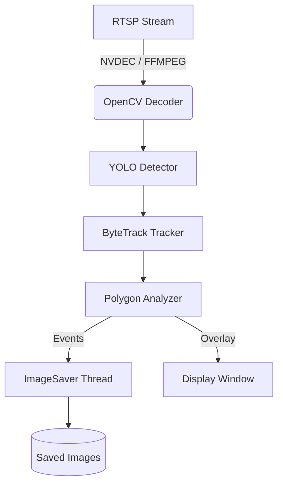
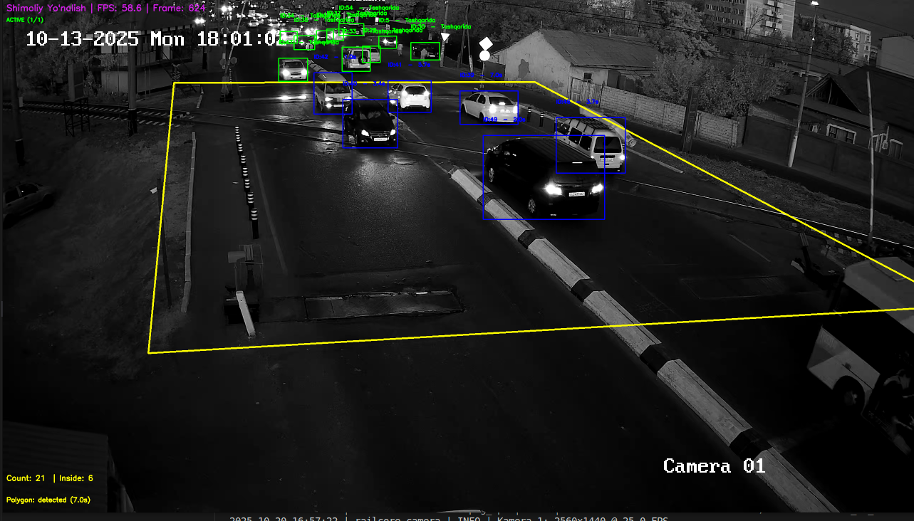

# 🚦 RailSafe — Intelligent Multi-Camera Vehicle Monitoring System

**RailSafe** — bu *real-time* YOLO asosidagi kuzatuv tizimi bo‘lib, temiryo‘l infratuzilmasidagi kameralar oqimini tahlil qiladi, transport vositalarining polygon ichiga kirish/chiqish holatlarini kuzatadi va qoidabuzarlik holatlarini avtomatik aniqlaydi.

---

## ⚙️ Asosiy imkoniyatlar

- 🎥 **Ko‘p kamerali ishlov** — bir nechta RTSP manbalar bilan parallel ishlaydi  
- ⚡ **GPU tezlashtirish (NVDEC + CUDA)** — GStreamer orqali video dekodlash  
- 🧠 **YOLO + ByteTrack** — aniqlash va kuzatish uchun  
- 🧩 **Adaptiv frame processing** — holatga qarab FPSni avtomatik boshqarish  
- 🖼️ **Asenkron rasm saqlash** — hodisalarni (`enter`, `exit`, `violation`) alohida papkalarda saqlaydi  
- 📈 **Log va kuzatuv** — toza terminal chiqishlari, FPS hisoblash, va avtomatik qayta ulanadigan oqimlar  

---

## 🗂️ Loyiha tuzilmasi

```

railsafe/
├─ app.py                      # Kirish nuqtasi (CLI / run)
├─ requirements.txt
├─ config/
│  ├─ config.yaml              # Model, kamera, threshold, processing sozlamalari
│  └─ trackers/
│     └─ bytetrack.yaml        # YOLO tracking konfiguratsiyasi
├─ railcore/
│  ├─ logging_setup.py         # Logger konfiguratsiya
│  ├─ types.py                 # Typed dataclass’lar (FrameEvent, CameraCfg, ...)
│  ├─ utils_polygon.py         # Polygon mask, point-in-polygon va chizish
│  ├─ saver.py                 # ImageSaver (queue + thread)
│  ├─ decoder/
│  │  ├─ base.py               # Interface: .read(), .reopen()
│  │  ├─ gst_nvdec.py          # GStreamer NVDEC pipeline (GPU decoding)
│  │  └─ ffmpeg_cpu.py         # Fallback: OpenCV + FFMPEG (CPU decoding)
│  ├─ vision/
│  │  ├─ yolo_detector.py      # YOLO model wrapper (Ultralytics)
│  │  └─ tracking.py           # Tracking mantiqi (enter/exit/violation)
│  └─ camera.py                # PolygonCamera (barcha modullarni birlashtiradi)
└─ README.md

````

---

## 🧰 O‘rnatish

```bash
# 1️⃣ Klonni yuklang
git clone https://github.com/your-org/railsafe.git
cd railsafe

# 2️⃣ Kerakli kutubxonalarni o‘rnating
pip install -r requirements.txt
````

---

## ⚡ Ishga tushirish

```bash
python app.py
```

Tizim `config/config.yaml` faylidagi barcha **faol kameralarni** topadi va har biri uchun alohida **thread** ochadi.

Har bir oynada kamera nomi, FPS, va obyektlar holati ko‘rsatiladi.

> 🟢 Chiqarishdan chiqish uchun `Q` tugmasini bosing.

---

## ⚙️ Konfiguratsiya (config.yaml)

```yaml
model:
  path: models/yolov8n.pt
  target_classes: [2, 3, 5, 7]
  class_names: ["car", "truck", "bus", "train"]

thresholds:
  warning: 2.0
  violation: 5.0

processing:
  adaptive_mode: true
  frame_skip_idle: 3
  frame_skip_active: 2

cameras:
  - id: 1
    name: "Toshkent Janubiy"
    source: "rtsp://192.168.0.101/stream1"
    polygon_file: "polygons/polygon_1.json"
    enabled: true
```

---

## 🧩 Texnik arxitektura



---

## 🧠 Texnologiyalar

| Modul            | Texnologiya / Kutubxona                            |
| ---------------- | -------------------------------------------------- |
| Model            | [Ultralytics YOLOv8](https://docs.ultralytics.com) |
| Tracker          | ByteTrack                                          |
| GPU Decoding     | GStreamer + NVDEC                                  |
| Visualization    | OpenCV                                             |
| Asenkron saqlash | Thread + Queue                                     |
| Konfiguratsiya   | YAML                                               |

---

## 🛡️ Log va kuzatuv

Loglar `logging_setup.py` orqali boshqariladi.
Ultralytics loglari avtomatik `ERROR` darajasiga tushirilgan,
lekin siz istasangiz `INFO` yoki `DEBUG` darajaga o‘zgartirishingiz mumkin.

---

## 🗃️ Saqlanadigan fayllar tuzilmasi

```
saved_images/
├─ camera_1/
│  ├─ enter/
│  ├─ exit/
│  └─ violation/
└─ camera_2/
   └─ ...
```

Har bir fayl nomi:

```
cam<id>_<event>_id<track>_<timestamp>.jpg
```

masalan:

```
cam2_violation_id14_20251020_121834_453.jpg
```

---

## 👨‍💻 Mualliflar va hissa qo‘shish

RailSafe — **Bahrombek Rahmonov** tomonidan ishlab chiqilgan
va “O‘zbekiston temir yo‘llari” tizimidagi **AI kuzatuv loyihalari** uchun mo‘ljallangan.

---

## 🧾 Litsenziya

MIT License — erkin foydalanish, o‘zgartirish va tarqatish mumkin.

---

### ❤️ Tavsiyalar

* GPU dekodlash uchun **NVIDIA driver + GStreamer** to‘liq o‘rnatilgan bo‘lishi kerak
* Har bir kamera uchun `.json` polygon fayli bo‘lishi shart
* FPS past bo‘lsa — `sync=false`, `max-buffers=1`, va `latency` parametrlarini tekshiring

---

**RailSafe — Smart Infrastructure, Safe Movement. 🚉**

```

---
